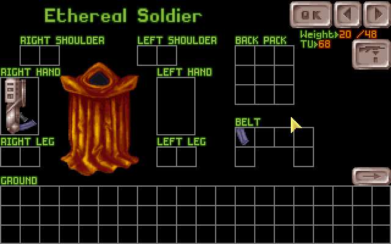

# Alien Inventory Mod

This mod enables the doll image of aliens to be seen in the inventory screen, when they are mind-controlled.
The repository stores the partial sources for the mod.
Current version can be downloaded from: [http://www.openxcom.com/mod/alien-inventory-mod](http://www.openxcom.com/mod/alien-inventory-mod).
It is also part of the Final Mod Pack: [https://openxcom.mod.io/final-mod-pack](https://openxcom.mod.io/final-mod-pack).

Recreating the images:

Sources:
- UP*.png are from [https://www.ufopaedia.org/](https://www.ufopaedia.org/)
- Unitsmasks.png file is from [ufo2000](http://ufo2000.sourceforge.net/) and GPL'ed

How to:
- Run the shell script, which creates the 24-bit color inventory images (you need imagemagick)
- Open gimp, paste each image into bspalette.gif to apply the correct battlescape palette
- Now you have the 8-bit images with the correct colors & nice color quantization of gimp
